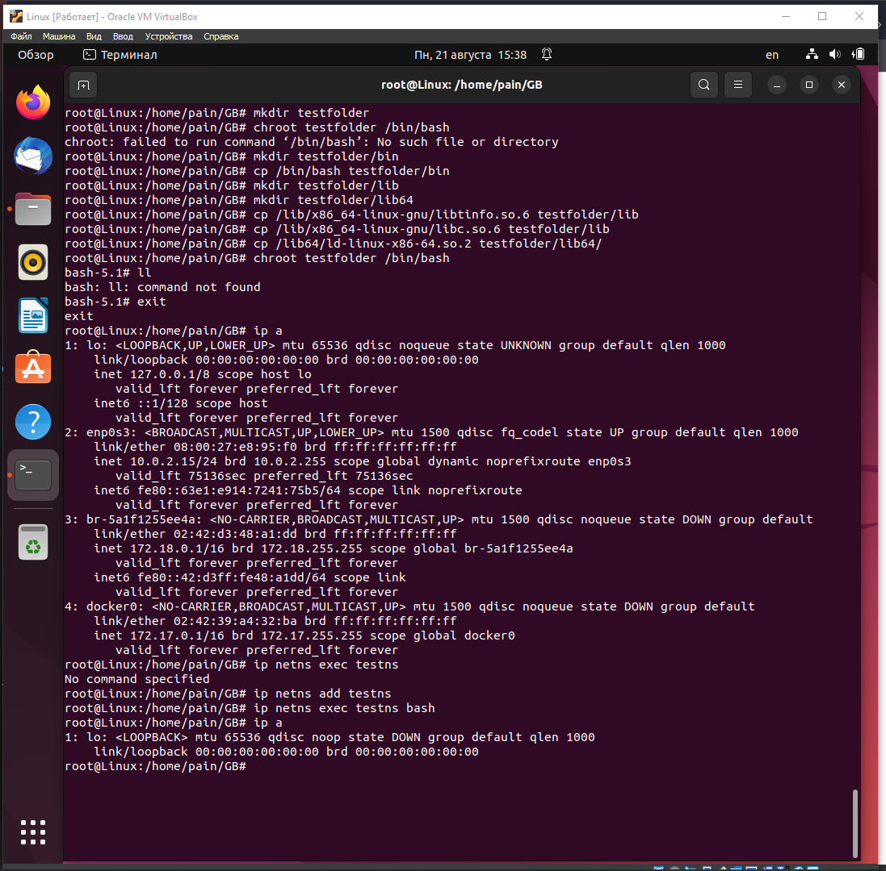
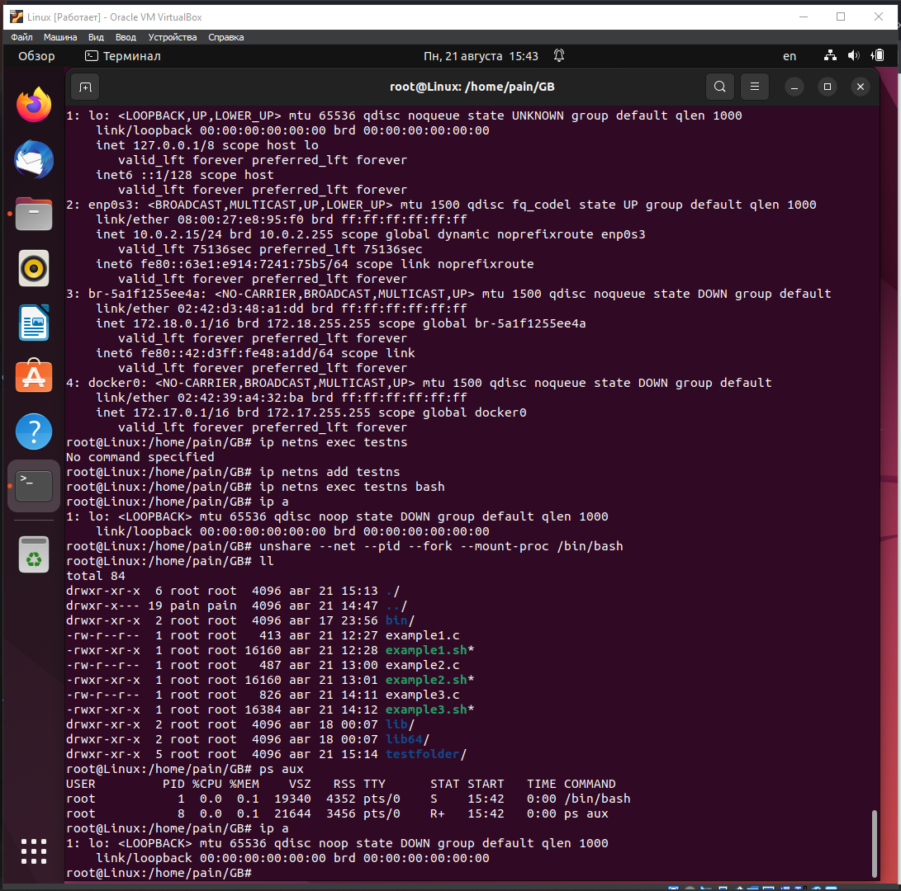

### Создаём директорию и копируем туда bash
```sh
sudo su
mkdir testfolder
mkdir testfolder/bin
cp /bin/bash testfolder/bin
```
### Создаём директории для библиотек и копируем недостающие для bash 
```sh
mkdir testfolder/lib
mkdir testfolder/lib64
ldd /bin/bash
cp /lib/x86_64-linux-gnu/libtinfo.so.6 testfolder/lib
cp /lib/x86_64-linux-gnu/libc.so.6 testfolder/lib
cp /lib64/ld-linux-x86-64.so.2 testfolder/lib64/
```
### Меняем корневой каталог для текущего процессы на testfolder и пробуем вызвать ls
```sh
chroot testfolder /bin/bash
ls
```

### Создаём новое пространство имён для изоляции сетевых ресурсов с названием testns. Выводим на экран список доступных пространств имён
```sh
exit
ip netns add testns
```
### Запускаем оболочку bash внутри пространства имён testns
```sh
ip netns exec testns bash
ip a
```


### Создаем новый процесс с изолированными сетевыми и процессными пространствами, а также монтирует файловую систему /proc для наблюдения за процессами. Запускаем оболочку Bash в этом новом изолированном окружении.
```sh
unshare --net --pid --fork --mount-proc /bin/bash
```
### Выводим список файлов и каталогов в текущем рабочем каталоге.
```sh
ls
```
### Выводим список текущих процессов внутри изолированной среды.
```sh
ps aux
```
### Выводим информацию о сетевых интерфейсах внутри изолированной среды
```sh
ip a
```



