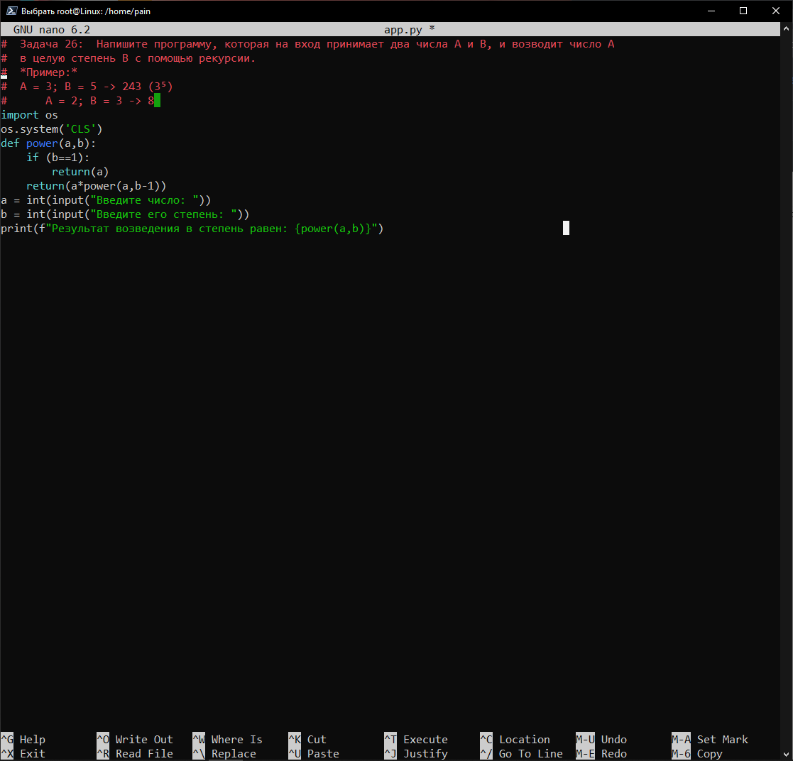
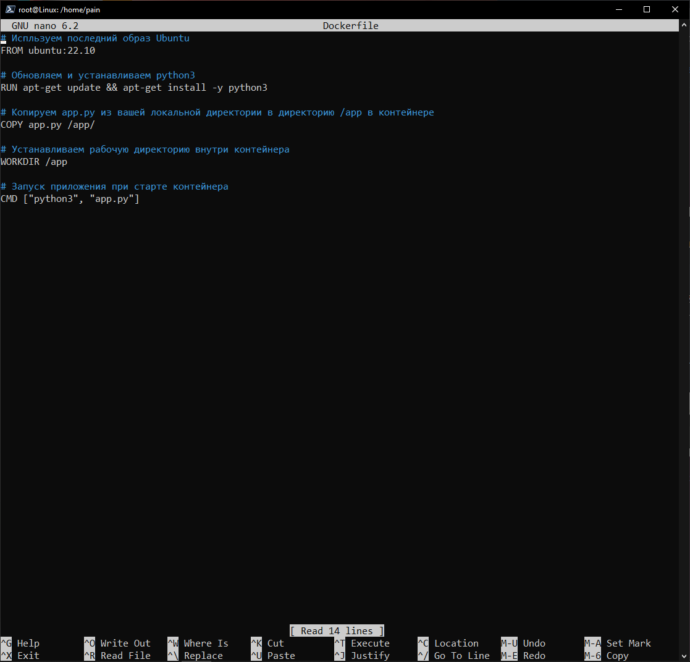
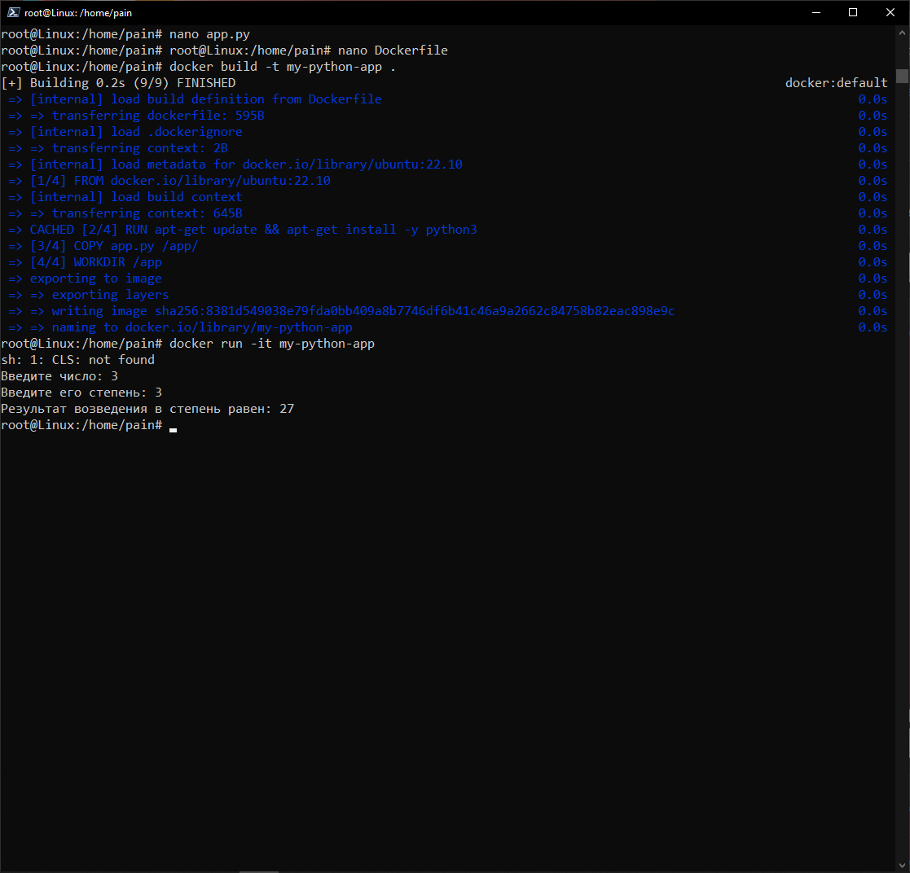

# Домашняя работа №4
## Dockerfile и слои
### Создание Dockerfile

1. Создаем python-файл;
    ```
    nano app.py
    ```

2. Прописываем код исполнения программы на python;
    ```
    Задача 26:  Напишите программу, которая на вход принимает два числа A и B, и возводит число А
    в целую степень B с помощью рекурсии.
    *Пример:*
    A = 3; B = 5 -> 243 (3⁵)
    A = 2; B = 3 -> 8
    import os
    os.system('CLS')
    def power(a,b):
    if (b==1):
        return(a)
    return(a*power(a,b-1))
    a = int(input("Введите число: "))
    b = int(input("Введите его степень: "))
    print(f"Результат возведения в степень равен: {power(a,b)}")
    ```
    

3. Создаем Dockerfile;
    ```
    nano Dockerfile
    ```

4. Прописываем инструкции в несколько слоев;
    ```
    FROM ubuntu:22.10
    RUN apt-get update && apt-get install -y python3
    COPY app.py /app/
    WORKDIR /app
    CMD ["python3", "app.py"]
    ```
    

5. Собираем докерфайл;
    ```
    docker build -t my-python-app .
    ```

6. Запускаем контейнер из созданного образа;
    ```
    docker run -it my-python-app
    ```
    